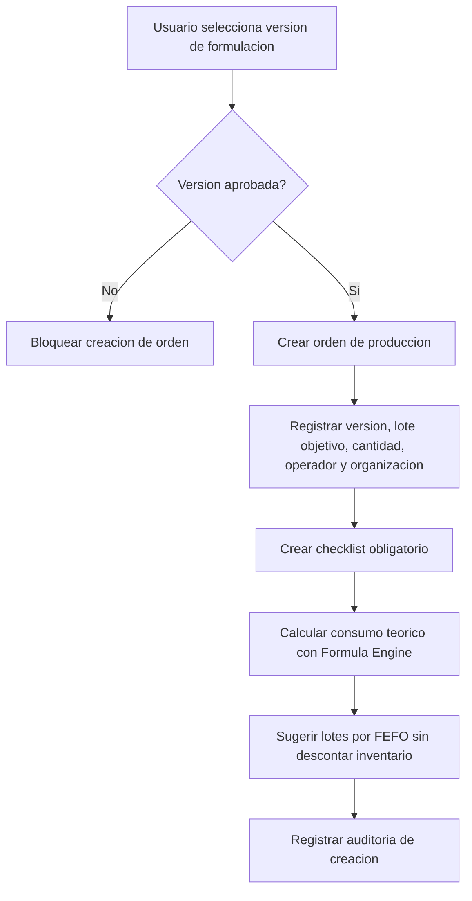
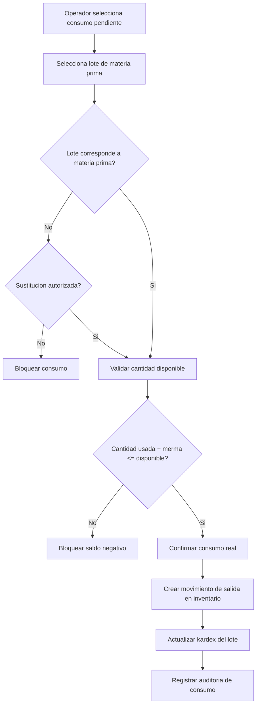
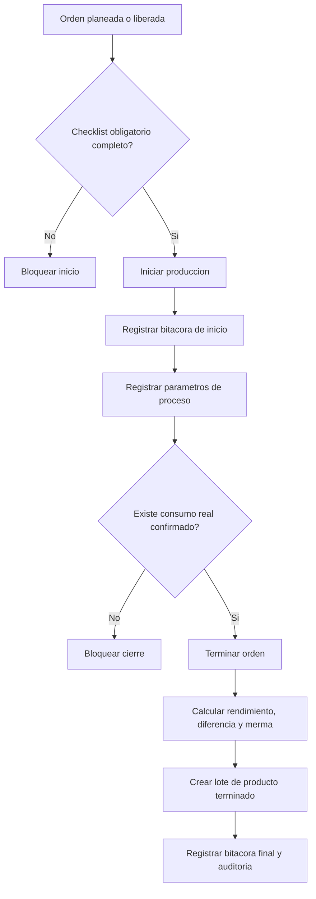

# Validacion Incremento 7 - Laboratorio y Produccion MVP

## Alcance Validado

- Ordenes de produccion desde versiones aprobadas.
- Consumo teorico calculado desde Formula Engine.
- Sugerencia de lotes por FEFO y disponibilidad.
- Consumo real con descuento de inventario y movimiento de kardex.
- Checklist obligatorio antes de iniciar.
- Bitacora cronologica y parametros de proceso.
- Cierre de orden con lote de producto terminado.
- Dashboard y UI tipo laboratorio.

## Diagramas Mermaid

### Generacion de Orden de Produccion

### Consumo Real e Inventario

### Inicio y Cierre de Produccion

## Pruebas Ejecutadas

- `npm.cmd run db:generate`
- `npm.cmd --workspace app/backend exec prisma migrate deploy`
- `npm.cmd run db:seed`
- `npm.cmd run build`
- `npm.cmd run test`
- `npm.cmd --workspace app/backend exec prisma migrate status`
- Validacion API: login, dashboard, listado, detalle, bloqueo de inicio con checklist pendiente, inicio correcto, consumo real, parametro de proceso y cierre.
- Validacion navegador desktop en `http://localhost:5173`.
- Validacion navegador movil con viewport 375 px.

## Resultados

- Build backend/frontend: correcto.
- Tests: 9 archivos, 21 pruebas aprobadas.
- Migraciones: 8 migraciones aplicadas y esquema al dia.
- Seed: correcto.
- Seed obligatorio cubre:
  - 5 ordenes demo.
  - 3 terminadas.
  - 1 en proceso.
  - 1 pausada.
  - consumos, mermas, lotes terminados, bitacoras y checklist.
- Validacion API creo una orden adicional de prueba, por eso la base local quedo con:
  - 6 ordenes.
  - 22 consumos.
  - 7 bitacoras.
  - 30 puntos de checklist.
  - 6 parametros de proceso.
  - 4 lotes terminados.
  - 9 registros de auditoria relacionados con produccion.

## Reglas Validadas

- No se permite fabricar una formulacion no aprobada.
- No se permite iniciar produccion con checklist obligatorio pendiente.
- No se permite consumir mas inventario del disponible.
- No se permite cerrar una orden sin consumo registrado.
- El consumo real genera movimiento de inventario y actualiza kardex.
- El cierre crea lote de producto terminado.
- Las acciones relevantes quedan en `audit_log`.

## Evidencias Tecnicas

- `prisma migrate status`: Database schema is up to date.
- API:
  - `blockedStart`: 409.
  - `startedStatus`: `en_proceso`.
  - `confirmedConsumption`: 1.
  - `finishedLot`: `PT-OP-00006`.
  - `dashboardFinishedLots`: 4.
- Navegador desktop:
  - 6 tarjetas de orden.
  - 6 KPIs.
  - 5 checks visibles.
  - 7 consumos visibles.
  - sin overflow horizontal.
- Navegador movil:
  - ancho 375 px.
  - sin overflow horizontal.
  - panel lateral en posicion estatica.

## Errores Encontrados

- El primer intento de validacion API eligio un consumo sin lote FEFO sugerido; el sistema rechazo el consumo sin `rawMaterialLotId`.
- El cierre de esa orden fue rechazado correctamente porque no habia consumo registrado.

## Correcciones Realizadas

- No requirio correccion de codigo para ese caso: el comportamiento validado fue correcto.
- Se ajusto el script de validacion para elegir un consumo con lote FEFO sugerido.

## Limitaciones Pendientes

- No se implemento MRP.
- No se implementaron compras, ventas ni facturacion.
- No se implemento control de calidad avanzado.
- No se evaluan reglas quimicas; los parametros se registran solamente.
- El lote terminado queda en produccion, sin inventario operativo de producto terminado avanzado.

## Confirmacion Final

Incremento 7 implementado y validado tecnicamente.

Estado: PENDIENTE DE APROBACION FORMAL.
