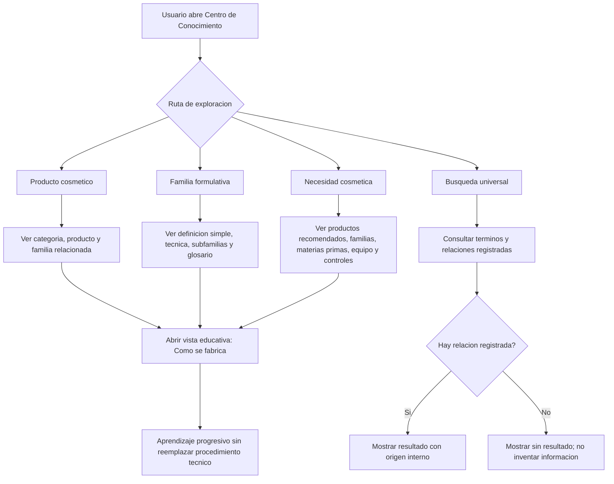
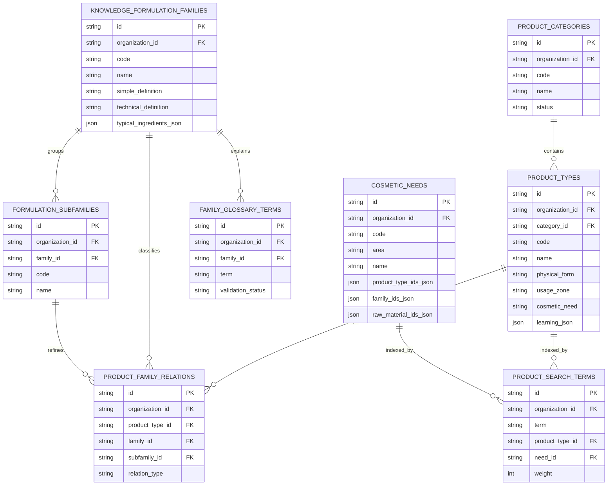

# Validacion Incremento 7.5 - Centro de Conocimiento Cosmetico

## Estado

Incremento 7.5 implementado y validado. Queda pendiente de aprobacion formal antes de iniciar el Incremento 8.

## Alcance validado

- Nuevo menu `Conocimiento` dentro del AppShell.
- Exploracion por categorias de producto cosmetico.
- Exploracion por familias y subfamilias formulativas.
- Exploracion por necesidades cosmeticas.
- Busqueda universal basada en catalogos, terminos y relaciones registradas.
- Seleccion guiada declarativa, sin IA generativa.
- Modo aprendizaje con explicacion progresiva.
- Integracion preparada con materias primas maestras, formulaciones, documentos, articulos y normas.
- Datos demo amplios para capacitacion inicial.

## Diagrama de flujo del proceso

## Diagrama entidad-relacion

## Pruebas ejecutadas

- `npm.cmd run build`
- `npm.cmd run test`
- `npm.cmd --workspace app/backend exec prisma migrate deploy`
- `npm.cmd --workspace app/backend exec prisma migrate status`
- `npm.cmd run db:seed`
- Validacion manual de API autenticada en `/knowledge-center/*`.
- Validacion visual en navegador local `http://localhost:5173`.

## Resultados

- Build backend/frontend: correcto.
- Pruebas Vitest: 10 archivos, 23 pruebas aprobadas.
- Migraciones Prisma: 9 migraciones aplicadas, base de datos actualizada.
- Seed: correcto.
- API autenticada:
  - Categorias: 13.
  - Productos: 97.
  - Familias formulativas de conocimiento: 14.
  - Relaciones producto-familia: 20.
  - Necesidades cosmeticas: 6.
  - Terminos de busqueda: 12.
  - Reglas de seleccion guiada: 3.
- Navegador desktop:
  - Pantalla `Centro de Conocimiento Cosmetico` visible.
  - 97 tarjetas cargadas.
  - 5 pestanas visibles.
  - 3 resultados para busqueda demo.
  - Panel lateral visible.
  - Sin overflow horizontal.
- Navegador movil:
  - Pantalla visible en ancho 375 px.
  - 97 tarjetas cargadas.
  - 5 pestanas visibles.
  - 3 resultados para busqueda demo.
  - Sin overflow horizontal.

## Errores encontrados

- La seleccion guiada no devolvia resultados cuando el usuario enviaba varios criterios porque se comparaba la frase completa contra cada campo de regla.

## Correcciones realizadas

- Se ajusto el puntaje de seleccion guiada para evaluar cada criterio por separado: resultado deseado, zona de uso, forma fisica, dificultad y necesidad cosmetica.
- Se revalido el endpoint y ahora devuelve reglas, productos, familias e insumos relacionados.

## Evidencias tecnicas

- API de salud: `http://localhost:4000/health` respondio `ok`.
- Frontend: `http://localhost:5173` respondio HTTP 200.
- Login demo autenticado usado para validacion: `demo@formulalab.local`.
- Endpoint `/knowledge-center/search?q=cabello%20seco` devolvio productos, familias y necesidades.
- Endpoint `/knowledge-center/guided-selection` devolvio reglas y relaciones despues de la correccion.

## Limitaciones pendientes

- No se implementa IA generativa.
- No se crean recetas ni procedimientos productivos nuevos desde el aprendizaje.
- No se reemplazan procedimientos tecnicos validados.
- Articulos, normas y documentos quedan preparados como relaciones futuras, no como repositorio documental avanzado.
- El Incremento 8 no fue iniciado.

## Confirmacion final

Incremento 7.5 implementado y validado. Requiere aprobacion formal del usuario antes de iniciar el Incremento 8.
