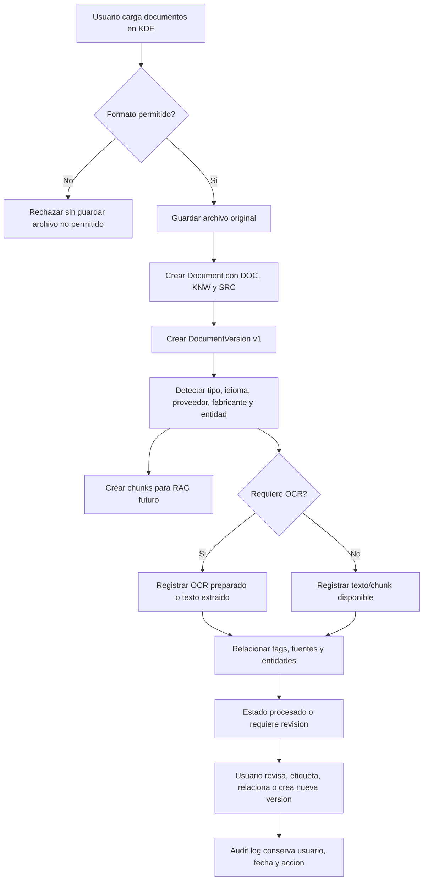
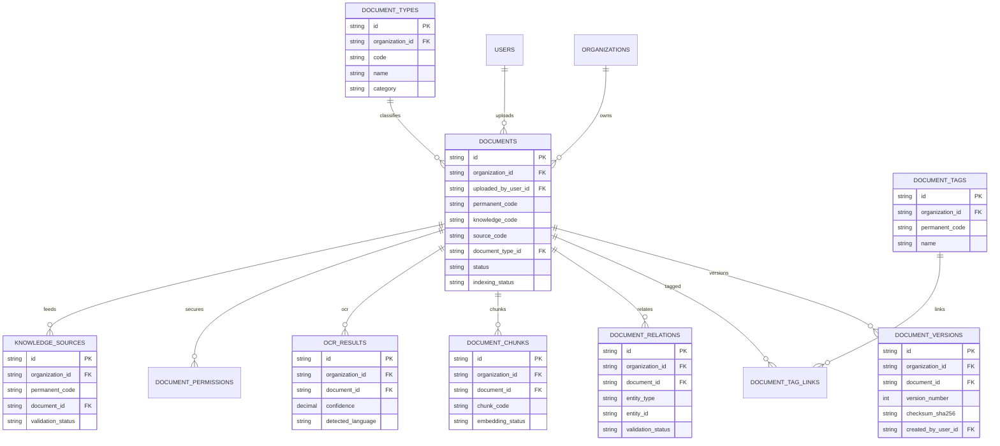

# Validacion Incremento 7.8 - Knowledge Document Engine

## Estado

Incremento 7.8 implementado y validado. Queda pendiente de aprobacion formal antes de iniciar el Incremento 8 LIMS.

## Alcance validado

- Repositorio documental transversal sobre `documents`.
- Tipos documentales: tecnicos, comerciales, cientificos, normativos, produccion y laboratorio.
- Carga multiformato: PDF, DOCX, XLSX, CSV, TXT, PNG, JPG, WEBP, TIFF, MP4, MOV y ZIP.
- Versionado sin sobrescritura.
- Etiquetas libres con codigo permanente.
- Relaciones reutilizables con multiples entidades.
- OCR preparado y resultados demo trazables.
- Chunks preparados para RAG futuro sin generar embeddings.
- Busqueda universal documental por metadata, tags, OCR y chunks.
- Vista previa integrada para PDF, imagen, TXT y CSV.
- Dashboard documental.
- UI ERP con explorador, drag & drop, tarjetas/lista, filtros y panel lateral.

## Diagrama de flujo documental

## Diagrama ER de tablas creadas o modificadas

## Pruebas ejecutadas

- `npm.cmd run db:generate`
- `npm.cmd run build`
- `npm.cmd run test`
- `npm.cmd --workspace app/backend exec prisma migrate deploy`
- `npm.cmd run db:seed`
- `npm.cmd --workspace app/backend exec prisma migrate status`
- Validacion API autenticada en `/kde/*`.
- Validacion navegador desktop y movil en `http://localhost:5173`.
- Carga real multiple de TXT, CSV y PNG por API.

## Resultados

- Build backend/frontend: correcto.
- Pruebas Vitest: 11 archivos, 25 pruebas aprobadas.
- Migraciones Prisma: 10 migraciones aplicadas, base de datos actualizada.
- Seed: correcto.
- Dashboard KDE despues de validacion:
  - Documentos: 66 antes de carga real de prueba.
  - Pendientes/revision: 7.
  - Versionados: 5.
  - Indexados/preparados: 50.
- Conteos SQL:
  - `documents`: 66 antes de carga real de prueba.
  - `document_versions`: 55.
  - `document_types`: 35.
  - `document_tags`: 13.
  - `document_relations`: 51.
  - `document_chunks`: 50.
  - `ocr_results`: 50.
  - `document_status`: 5.
  - `knowledge_sources`: 50.
- Carga real multiple:
  - TXT: `DOC-000051`, procesado.
  - CSV: `DOC-000052`, procesado.
  - PNG: `DOC-000053`, requiere revision por OCR pendiente.
- Navegador desktop:
  - 66 tarjetas visibles antes de carga real de prueba.
  - 4 indicadores visibles.
  - Dropzone visible.
  - Panel lateral visible.
  - Sin overflow horizontal.
- Navegador movil:
  - 66 tarjetas visibles antes de carga real de prueba.
  - 4 indicadores visibles.
  - Sin overflow horizontal en 375 px.

## Errores encontrados

- Prisma Client no pudo regenerarse inicialmente porque el DLL estaba bloqueado por procesos Node activos.
- El build detecto un tipado en el endpoint de nueva version documental.
- La UI movil presento overflow horizontal inicial por minimo de tarjetas/indicadores KDE.
- `C:\tmp` no permitio crear archivos temporales de prueba desde PowerShell.

## Correcciones realizadas

- Se detuvieron temporalmente los procesos Node/NPM del proyecto, se regenero Prisma y se levantaron de nuevo backend/frontend.
- Se normalizo `documentId` y `changeReason` en la ruta de versionado.
- Se ajusto CSS responsive de KDE para eliminar overflow horizontal.
- Se usaron archivos temporales dentro del workspace y se eliminaron despues de validar la carga multiple.

## Limitaciones pendientes

- OCR real queda preparado; no se integra todavia un motor externo.
- Embeddings quedan preparados; no se generan vectores todavia.
- Permisos por rol quedan modelados; no se implementa matriz avanzada de autorizacion.
- La extraccion de DOCX/XLSX/video/ZIP queda como metadata inicial y repositorio trazable; parsing profundo queda para incrementos futuros.
- No se inicia Incremento 8 LIMS.

## Confirmacion final

Incremento 7.8 implementado y validado. Requiere aprobacion formal del usuario antes de iniciar el Incremento 8.
