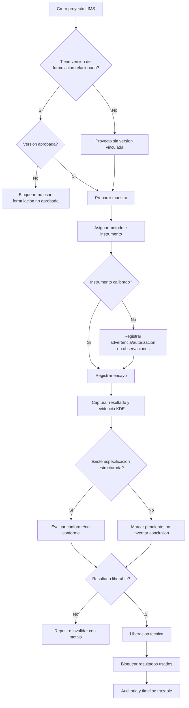
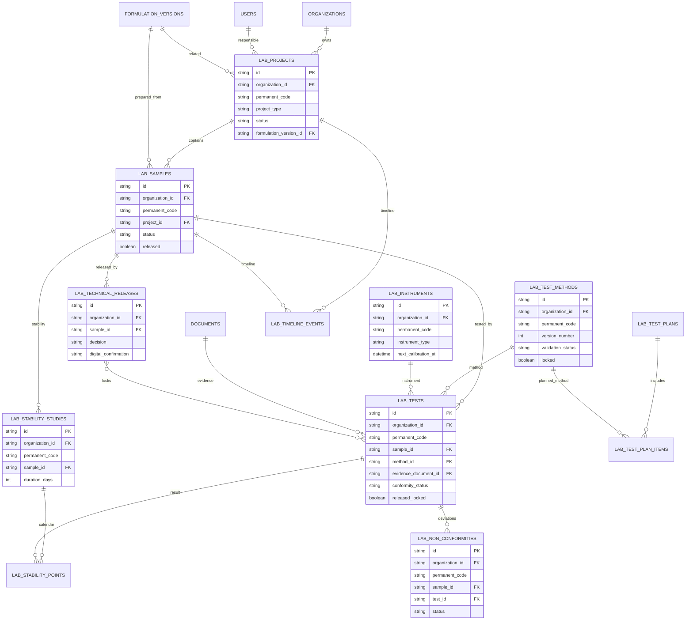

# Validacion Incremento 8 - LIMS

## Estado

Incremento 8 implementado y validado. Queda pendiente de aprobacion formal antes de iniciar el Incremento 9.

## Alcance validado

- Proyectos de laboratorio.
- Muestras.
- Planes de ensayo.
- Metodos versionados.
- Instrumentos con calibracion.
- Ensayos y resultados.
- Estudios de estabilidad.
- Timeline de seguimiento.
- No conformidades.
- Liberacion tecnica.
- Integracion con formulaciones aprobadas y KDE.
- Auditoria para acciones relevantes.
- UI moderna tipo laboratorio, desktop y movil.

## Mermaid Flowchart del proceso principal

## Mermaid erDiagram de tablas creadas o modificadas

## Pruebas ejecutadas

- `npm.cmd run db:generate`
- `npm.cmd run build`
- `npm.cmd run test`
- `npm.cmd --workspace app/backend exec prisma migrate deploy`
- `npm.cmd run db:seed`
- `npm.cmd --workspace app/backend exec prisma migrate status`
- Validacion API autenticada en `/lims/*`.
- Validacion navegador desktop y movil en `http://localhost:5173`.

## Resultados

- Build backend/frontend: correcto.
- Pruebas Vitest: 12 archivos, 27 pruebas aprobadas.
- Migraciones Prisma: 11 migraciones aplicadas, base de datos actualizada.
- Seed: correcto.
- API LIMS:
  - Proyectos: 5.
  - Muestras: 12.
  - Metodos: 10.
  - Instrumentos: 8.
  - Ensayos: 30 demo, 32 despues de validar creacion/repeticion por API.
  - Estudios de estabilidad: 3.
  - No conformidades: 2.
  - Liberaciones tecnicas: 2.
- Navegador desktop:
  - Pantalla `Laboratorio trazable` visible.
  - 6 indicadores visibles.
  - 5 tabs visibles.
  - Panel lateral visible.
  - Sin overflow horizontal.
- Navegador movil:
  - Pantalla visible en ancho 375 px.
  - 6 indicadores visibles.
  - Sin overflow horizontal.

## Errores encontrados

- Prisma Client quedo bloqueado temporalmente por procesos Node activos durante generacion.
- Frontend requirio declarar `timelineEvents` en `LabSample`.
- Frontend requirio usar `ReactNode` en el componente de metricas.

## Correcciones realizadas

- Se detuvieron temporalmente procesos Node/NPM del proyecto para regenerar Prisma.
- Se agregaron relaciones inversas necesarias en Prisma.
- Se corrigieron tipos frontend.
- Se levantaron de nuevo backend y frontend, dejando `4000` y `5173` activos.

## Validaciones de reglas obligatorias

- Proyectos con version de formulacion validan estado `aprobada`.
- Resultados liberados quedan bloqueados con `released_locked`.
- Repeticion e invalidacion requieren motivo.
- Evidencia documental se relaciona mediante KDE (`documents`), sin repositorio paralelo.
- Evaluacion automatica solo ocurre cuando hay especificacion numerica estructurada; si no, queda pendiente.
- No se implementa IA generativa ni conclusiones automaticas sin reglas validadas.

## Limitaciones pendientes

- Control de Calidad completo de planta queda fuera de alcance.
- Compras, ventas e IA generativa no fueron implementadas.
- Firma digital es confirmacion basica, no firma criptografica avanzada.
- Calendario de estabilidad es funcional demo; planificador avanzado queda para futuro.

## Confirmacion final

Incremento 8 implementado y validado. Requiere aprobacion formal del usuario antes de iniciar el Incremento 9.
