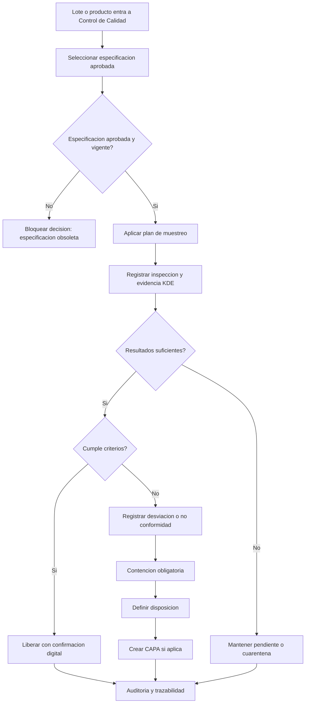
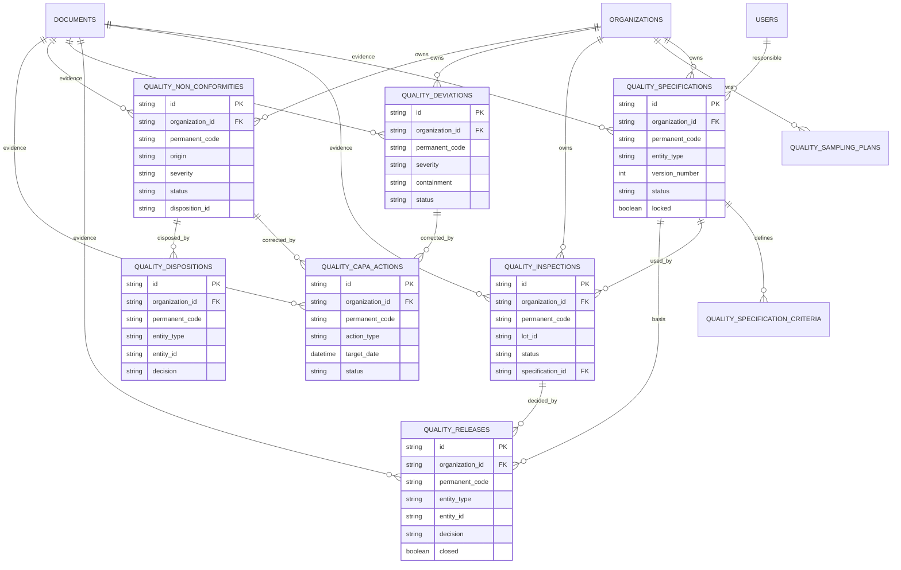

# Validacion Incremento 9 - Control de Calidad

## Estado

Incremento 9 implementado y validado. Queda pendiente de aprobacion formal antes de iniciar el Incremento 10.

## Alcance validado

- Especificaciones versionadas.
- Criterios de calidad.
- Planes de muestreo.
- Inspeccion de recepcion.
- Control de proceso y producto terminado preparado.
- Liberacion, rechazo, cuarentena y bloqueo.
- Desviaciones.
- No conformidades.
- CAPA.
- Disposiciones.
- Reportes preparados.
- Evidencias KDE.
- Dashboard y UI responsive.

## Mermaid Flowchart del proceso principal

## Mermaid erDiagram de tablas creadas o modificadas

## Pruebas ejecutadas

- `npm.cmd run db:generate`
- `npm.cmd run build`
- `npm.cmd run test`
- `npm.cmd --workspace app/backend exec prisma migrate deploy`
- `npm.cmd run db:seed`
- `npm.cmd --workspace app/backend exec prisma migrate status`
- Validacion API autenticada en `/quality/*`.
- Validacion navegador desktop y movil en `http://localhost:5173`.

## Resultados

- Build backend/frontend: correcto.
- Pruebas Vitest: 13 archivos, 29 pruebas aprobadas.
- Migraciones Prisma: 12 migraciones aplicadas, base de datos actualizada.
- Seed base: 10 especificaciones, 5 planes, 15 inspecciones, 8 liberaciones, 4 desviaciones, 4 no conformidades, 5 CAPA, 4 disposiciones.
- Despues de validacion API:
  - Especificaciones: 10.
  - Planes: 5.
  - Inspecciones: 16.
  - Liberaciones: 9.
  - Desviaciones: 5.
  - No conformidades: 5.
  - CAPA: 6.
  - Disposiciones: 5.
- UI desktop:
  - Pantalla `Liberacion, cuarentena y CAPA` visible.
  - 6 indicadores visibles.
  - 5 tabs visibles.
  - Panel lateral visible.
  - Sin overflow horizontal.
- UI movil:
  - Pantalla visible a 375 px.
  - 6 indicadores visibles.
  - Sin overflow horizontal.

## Errores encontrados

- Prisma Client quedo bloqueado temporalmente por procesos Node activos durante generacion.
- Frontend requirio agregar `packageIntegrity` al tipo `QualityInspection`.
- El login visual usa boton `Entrar`; se ajusto la validacion de navegador al texto real.

## Correcciones realizadas

- Se detuvieron temporalmente procesos Node/NPM del proyecto para regenerar Prisma.
- Se corrigio el tipo frontend.
- Se levantaron de nuevo backend y frontend, dejando `4000` y `5173` activos.

## Validaciones de reglas obligatorias

- La liberacion valida especificacion aprobada y bloqueada.
- La desviacion exige contencion.
- La no conformidad cerrada exige disposicion.
- CAPA conserva responsable, fecha objetivo, prioridad y evidencia.
- Evidencia se relaciona mediante KDE.
- No se duplican resultados LIMS; se referencian por identificadores.
- No se implementan Compras, CRM, Ventas ni Facturacion.

## Confirmacion final

Incremento 9 implementado y validado. Requiere aprobacion formal del usuario antes de iniciar el Incremento 10.
