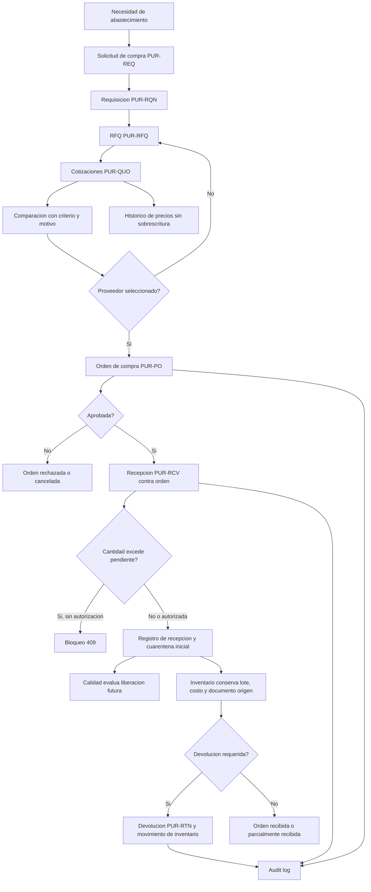
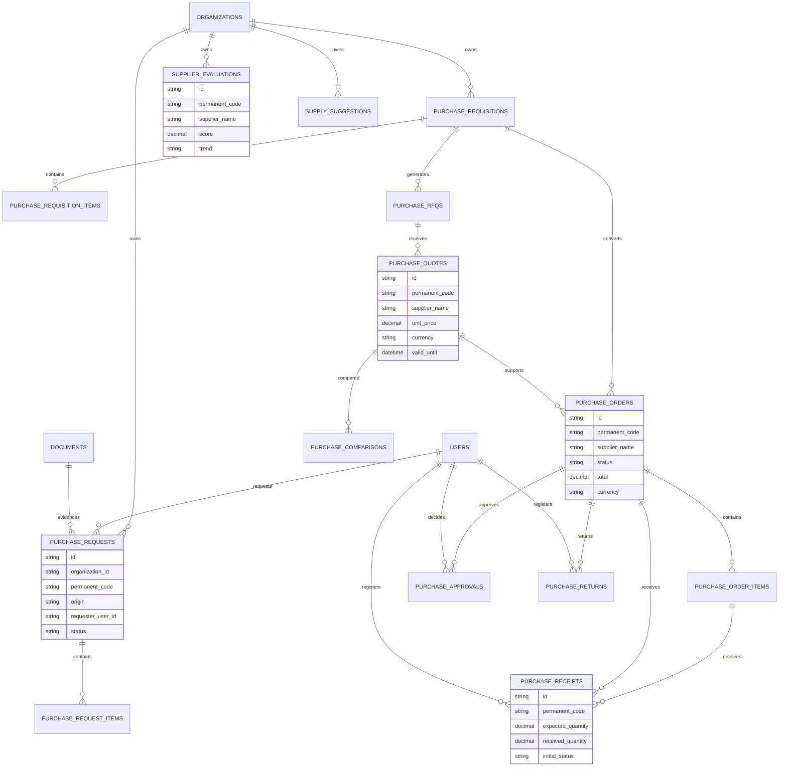

# Validacion Incremento 10 - Compras y Abastecimiento

## Estado

Incremento 10 implementado y validado tecnicamente. Pendiente de aprobacion formal del usuario.

## Alcance Validado

- Solicitudes de compra con renglones y trazabilidad documental.
- Requisiciones, RFQ, cotizaciones y comparativas.
- Ordenes de compra con proveedor, renglones, moneda, importes y aprobacion.
- Recepciones contra orden con soporte de recepcion parcial.
- Devolucion a proveedor con movimiento de inventario preparado.
- Evaluacion de proveedores y sugerencias de abastecimiento.
- Integracion con materias primas maestras, productos comerciales, historico de precios, inventario, calidad, KDE y auditoria.
- UI ERP en espanol con dashboard, panel lateral, acciones guiadas, alertas y modo aprendizaje.

## Diagrama de Flujo

## Diagrama ER

## Pruebas Ejecutadas

- `npm.cmd run db:generate`
- `npm.cmd run build`
- `npm.cmd --workspace app/backend exec prisma migrate deploy`
- `npm.cmd run db:seed`
- `npm.cmd test`
- Validacion API autenticada:
  - `GET /purchases/dashboard`
  - `GET /purchases/orders`
  - `GET /purchases/receipts`
  - `POST /purchases/orders` con renglones vacios para validar rechazo.
- Validacion navegador desktop en `http://localhost:5173`.
- Validacion navegador movil 390 x 844.

## Resultados

- Build backend/frontend correcto.
- Migracion `20260803053000_incremento_10_compras` aplicada correctamente con `prisma migrate deploy`.
- Seed ejecutado sin errores.
- Pruebas: 14 archivos, 32 pruebas aprobadas.
- API autenticada:
  - Solicitudes abiertas: 8.
  - Ordenes: 5.
  - Recepciones: 4.
  - Rechazo de OC sin renglones: HTTP 400.
- Conteo directo de base:
  - 8 solicitudes.
  - 4 requisiciones.
  - 4 RFQ.
  - 10 cotizaciones.
  - 4 comparativas.
  - 5 ordenes de compra.
  - 4 recepciones.
  - 1 devolucion.
  - 3 evaluaciones de proveedor.
  - 8 sugerencias de abastecimiento.
- Navegador desktop: pantalla Compras carga ordenes, KPIs, panel lateral y acciones sin errores de consola.
- Navegador movil: sin overflow horizontal; panel lateral pasa a posicion estatica.

## Errores Encontrados y Correcciones

- `prisma generate` quedo bloqueado por DLL en uso. Se detuvieron procesos Node/NPM del proyecto y se regenero el cliente.
- `prisma migrate dev` no pudo generar diff por una migracion historica que falla en shadow DB. Se creo migracion SQL manual del Incremento 10 y se aplico con `prisma migrate deploy`.
- TypeScript rechazo un helper generico de conteo Prisma. Se reemplazo por `switch` explicito tipado.
- El historial de precios existente exigia `createdByUserId` y `evidenceReference`; se ajusto la integracion de cotizaciones.

## Evidencias Tecnicas

- Migracion Prisma: `app/backend/prisma/migrations/20260803053000_incremento_10_compras/migration.sql`.
- SQL espejo: `database/migrations/013_incremento_10_compras.sql`.
- Servicio: `app/backend/src/services/purchases.service.ts`.
- Rutas: `app/backend/src/routes/purchases.routes.ts`.
- Validadores: `app/backend/src/validators/purchases.schemas.ts`.
- UI: `app/frontend/src/pages/PurchasesPage.tsx`.
- Pruebas: `tests/backend/purchases.test.ts`.

## Limitaciones Pendientes

- No se implemento compras avanzadas, MRP, facturacion ni contabilidad.
- No se implemento recepcion documental con carga especifica desde Compras; se relacionan documentos KDE existentes.
- La devolucion usa movimiento de inventario operativo, pero no genera nota fiscal ni flujo contable.
- No se consultan servicios externos de tipo de cambio.
- La liberacion de material recibido sigue perteneciendo a Calidad; Compras solo registra cuarentena inicial.

## Confirmacion Final

Incremento 10 requiere aprobacion formal del usuario antes de iniciar Incremento 11.
