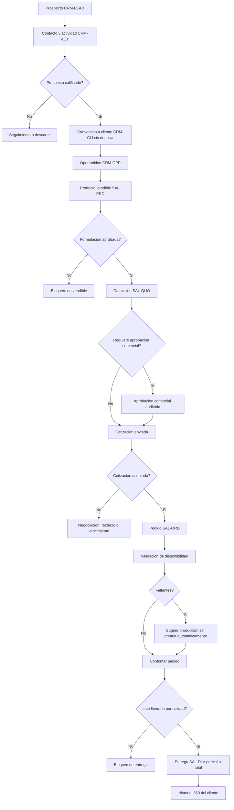
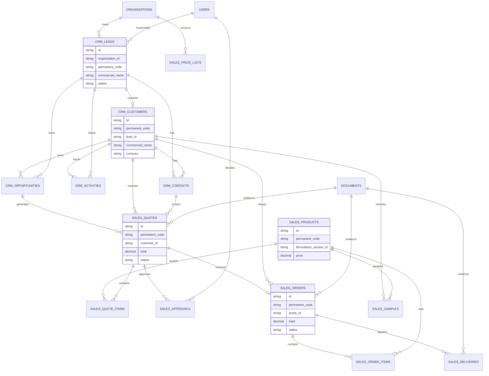

# Validacion Incremento 11 - CRM, Ventas y Pedidos

## Estado

Incremento 11 implementado y validado tecnicamente. Pendiente de aprobacion formal del usuario.

## Alcance Validado

- Prospectos, clientes, contactos y actividades comerciales.
- Conversion de prospecto a cliente sin duplicar informacion.
- Pipeline de oportunidades.
- Catalogo comercial de productos vendibles.
- Listas de precios versionadas.
- Cotizaciones comerciales, aprobaciones y pedidos.
- Validacion de disponibilidad y sugerencia de produccion.
- Entregas parciales preparadas y bloqueo de lotes no liberados por calidad.
- Muestras comerciales.
- Integracion documental KDE y auditoria.
- UI ERP con dashboard, Kanban, perfil 360, cotizador guiado, panel lateral y modo aprendizaje.

## Diagrama de Flujo

## Diagrama ER

## Pruebas Ejecutadas

- `npm.cmd run db:generate`
- `npm.cmd run build`
- `npm.cmd --workspace app/backend exec prisma migrate deploy`
- `npm.cmd run db:seed`
- `npm.cmd test`
- Validacion API autenticada:
  - `GET /sales/dashboard`
  - `GET /sales/quotes`
  - `GET /sales/orders`
  - `POST /sales/quotes` con partidas vacias para validar rechazo.
- Validacion navegador desktop en `http://localhost:5173`.
- Validacion navegador movil 390 x 844.

## Resultados

- Build backend/frontend correcto.
- Migracion `20260803063000_incremento_11_crm_ventas` aplicada correctamente con `prisma migrate deploy`.
- Seed ejecutado sin errores.
- Pruebas: 15 archivos, 34 pruebas aprobadas.
- API autenticada:
  - Dashboard comercial responde.
  - Cotizaciones: 8.
  - Pedidos: 5.
  - Rechazo de cotizacion sin partidas: HTTP 400.
- Conteo directo de base:
  - 12 prospectos.
  - 6 clientes.
  - 18 contactos.
  - 25 actividades.
  - 10 oportunidades.
  - 12 productos vendibles.
  - 3 listas de precios.
  - 8 cotizaciones.
  - 5 pedidos.
  - 3 entregas.
  - 4 muestras comerciales.
- Navegador desktop: CRM/Ventas carga dashboard, pipeline, acciones y panel lateral sin errores de consola.
- Navegador movil: sin overflow horizontal; panel lateral pasa a posicion estatica.

## Errores Encontrados y Correcciones

- `prisma generate` quedo bloqueado por DLL en uso. Se detuvieron procesos Node/NPM del proyecto y se regenero el cliente.
- Prisma requirio relacion inversa entre prospecto y cliente convertido; se agrego `CrmLead.customer`.
- Seed fallo por evidencia KDE fuera de rango (`kde-doc-052`). Se ajustaron muestras comerciales a documentos existentes.
- Se normalizo el JSON nullable de etiquetas para cumplir contrato Prisma.

## Evidencias Tecnicas

- Migracion Prisma: `app/backend/prisma/migrations/20260803063000_incremento_11_crm_ventas/migration.sql`.
- SQL espejo: `database/migrations/014_incremento_11_crm_ventas.sql`.
- Servicio: `app/backend/src/services/sales.service.ts`.
- Rutas: `app/backend/src/routes/sales.routes.ts`.
- Validadores: `app/backend/src/validators/sales.schemas.ts`.
- UI: `app/frontend/src/pages/SalesPage.tsx`.
- Pruebas: `tests/backend/sales.test.ts`.

## Limitaciones Pendientes

- No se implemento facturacion fiscal, cobranza bancaria, contabilidad completa ni e-commerce publico.
- La disponibilidad de producto terminado queda como snapshot comercial preparado; no reserva ni consume inventario automaticamente.
- La produccion se sugiere, pero no se crea automaticamente.
- Las entregas validan bloqueo por estado informado y quedan preparadas para integracion avanzada con liberaciones de Calidad.
- Los impuestos quedan preparados, no fiscales.

## Confirmacion Final

Incremento 11 requiere aprobacion formal del usuario antes de iniciar Incremento 12.
