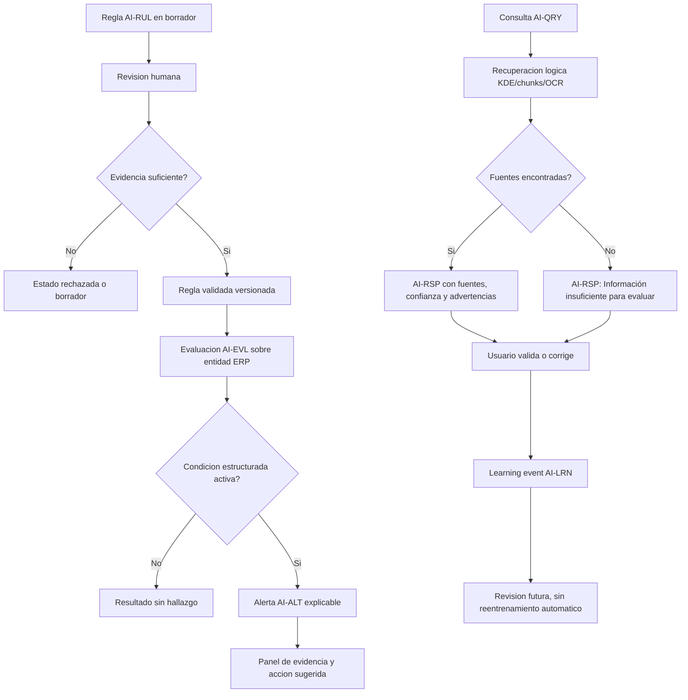
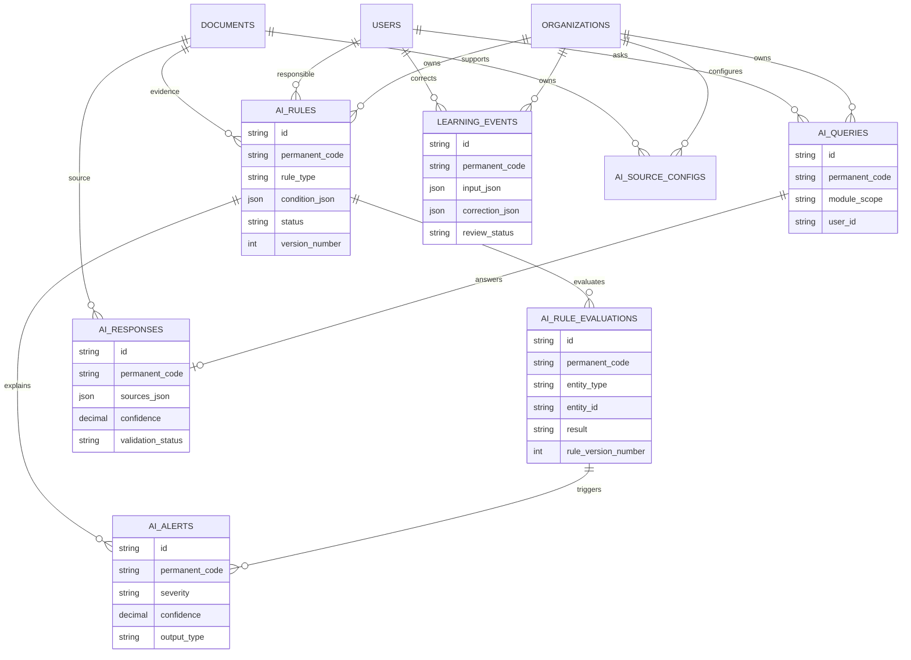

# Validacion Incremento 12 - IA Responsable y Motor de Reglas

## Estado

Incremento 12 implementado y validado tecnicamente. Pendiente de aprobacion formal del usuario.

## Alcance Validado

- Motor de reglas estructuradas y versionadas.
- Evaluador de reglas sobre entidades del ERP.
- Alertas explicables con evidencia, fuente, confianza y severidad.
- Centro de consultas con respuestas no validadas y fuentes visibles.
- Recuperacion logica preparada sobre KDE, documentos, chunks, OCR y entidades registradas.
- Eventos de aprendizaje por correcciones, rechazos y validaciones.
- Confiabilidad de fuentes y proveedor IA configurable sin claves reales.
- Dashboard de inteligencia y UI ERP responsive.

## Diagrama de Flujo

## Diagrama ER

## Pruebas Ejecutadas

- `npm.cmd run db:generate`
- `npm.cmd run build`
- `npm.cmd --workspace app/backend exec prisma migrate deploy`
- `npm.cmd run db:seed`
- `npm.cmd test`
- Validacion API autenticada:
  - `GET /ai/dashboard`
  - `POST /ai/ask`
  - `POST /ai/evaluate`
  - conteo directo con Prisma.
- Validacion navegador desktop en `http://localhost:5173`.
- Validacion navegador movil 390 x 844.

## Resultados

- Build backend/frontend correcto.
- Migracion `20260803073000_incremento_12_ia_responsable` aplicada correctamente con `prisma migrate deploy`.
- Seed ejecutado sin errores.
- Pruebas: 16 archivos, 36 pruebas aprobadas.
- API autenticada:
  - Reglas activas demo: 6.
  - Alertas abiertas demo: 9.
  - Consulta demo respondida con evidencia y confianza 0.78.
  - Evaluacion demo ejecuto 14 reglas validadas.
- Conteo directo de base:
  - 20 reglas.
  - 44 evaluaciones despues de validacion API.
  - 26 alertas despues de validacion API.
  - 16 consultas.
  - 16 respuestas.
  - 10 eventos de aprendizaje.
  - 10 fuentes/proveedores configurables.
- Navegador desktop: UI IA Responsable carga dashboard, consola, evidencia, consultas y acciones sin errores de consola.
- Navegador movil: sin overflow horizontal; panel lateral pasa a posicion estatica.

## Errores Encontrados y Correcciones

- `prisma generate` quedo bloqueado por DLL en uso. Se detuvieron procesos Node/NPM del proyecto y se regenero el cliente.
- El modelo `DocumentChunk` usa `content`; se corrigio el recuperador que intentaba leer `text`.
- Se mantuvo `migrate deploy` por el problema historico de shadow DB con migraciones antiguas.

## Evidencias Tecnicas

- Migracion Prisma: `app/backend/prisma/migrations/20260803073000_incremento_12_ia_responsable/migration.sql`.
- SQL espejo: `database/migrations/015_incremento_12_ia_responsable.sql`.
- Servicio: `app/backend/src/services/ai.service.ts`.
- Rutas: `app/backend/src/routes/ai.routes.ts`.
- Validadores: `app/backend/src/validators/ai.schemas.ts`.
- UI: `app/frontend/src/pages/AiPage.tsx`.
- Pruebas: `tests/backend/ai.test.ts`.

## Limitaciones Pendientes

- No se implementaron embeddings reales ni proveedor externo.
- No se guardan claves ni secretos; la abstraccion de proveedor queda preparada.
- No se aprueban formulaciones, lotes, resultados, pedidos ni decisiones desde IA.
- Las respuestas quedan como `no_validada` y requieren revision humana.
- La recuperacion es logica por texto/metadata; busqueda semantica avanzada queda para incremento futuro.

## Confirmacion Final

Incremento 12 requiere aprobacion formal del usuario antes de iniciar Incremento 13.
