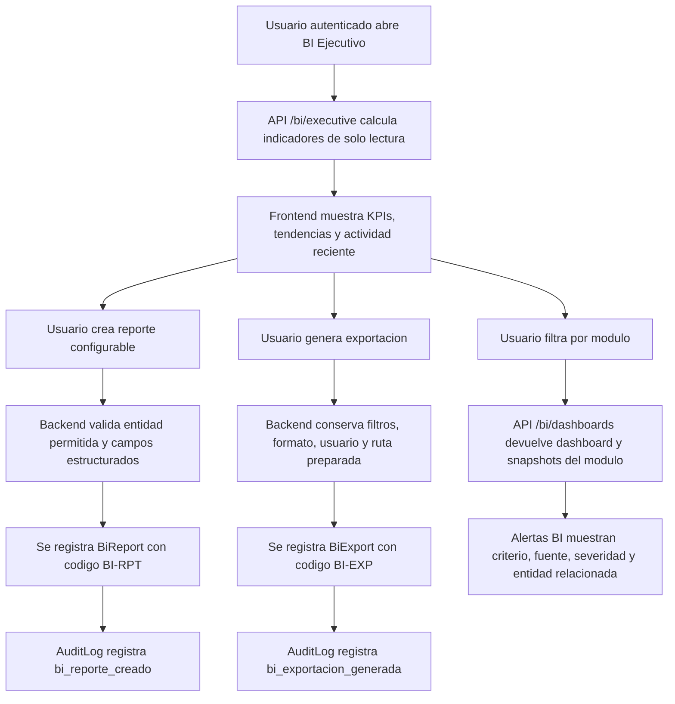
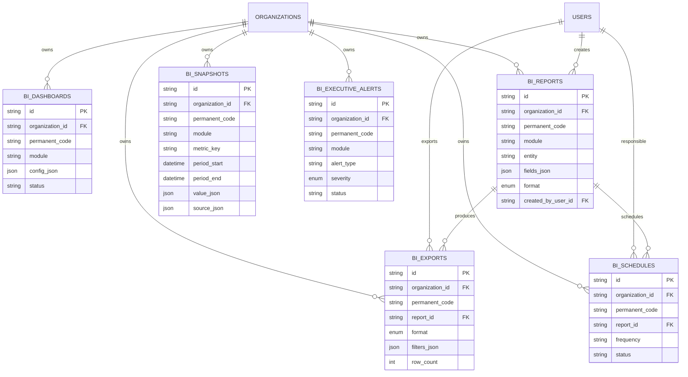

# Validacion Incremento 13 - Reportes, BI y Tablero Ejecutivo

Estado: IMPLEMENTADO, PENDIENTE DE APROBACION FORMAL.

## Alcance validado

- Tablero ejecutivo BI con KPIs consolidados.
- Dashboards por modulo.
- Reportes configurables sin SQL en frontend.
- Snapshots analiticos fechados.
- Alertas ejecutivas con fuente, criterio y severidad.
- Exportaciones auditadas en CSV, XLSX, PDF preparado y JSON.
- Programaciones preparadas de reportes.
- UI ERP responsive con graficas, filtros, panel lateral, vista rapida y modo aprendizaje.
- Separacion por `organization_id`.

## Diagrama de flujo del proceso

## Diagrama entidad-relacion

## Pruebas ejecutadas

- `npm.cmd run db:generate`: Prisma Client generado correctamente.
- `npm.cmd run build`: backend TypeScript y frontend Vite compilaron sin errores.
- `npm.cmd --workspace app/backend exec prisma migrate deploy`: migracion `20260803083000_incremento_13_bi_reportes` aplicada.
- `npm.cmd run db:seed`: seed ejecutado correctamente.
- `npm.cmd run test`: 17 archivos de prueba, 38 pruebas aprobadas.
- API `GET /health`: servicio disponible.
- API `POST /auth/login`: login demo correcto con `demo@formulalab.local`.
- API `GET /bi/executive`, `/bi/dashboards`, `/bi/reports`, `/bi/alerts`: respuesta correcta con datos de organizacion demo.
- API `POST /bi/reports`: creo `BI-RPT-000013`.
- API `POST /bi/exports`: creo `BI-EXP-000005`.
- Navegador desktop: modulo BI renderizado con 19 KPIs y panel lateral.
- Navegador movil 390 x 844: modulo BI visible sin overflow horizontal.

## Resultados

- Conteos persistidos despues de seed y validacion:
  - Dashboards BI: 8.
  - Reportes BI: 13, incluyendo reporte creado por API.
  - Snapshots BI: 6.
  - Alertas ejecutivas BI: 10.
  - Exportaciones BI: 5, incluyendo exportacion creada por API.
  - Programaciones BI: 3.
  - Auditorias BI: 2 acciones registradas.
- El constructor de reportes rechaza entidades fuera del contrato analitico.
- BI no modifica formulaciones, inventario, calidad, compras, ventas ni produccion.
- Los snapshots se guardan como registros fechados y no se recalculan silenciosamente.

## Correcciones realizadas durante la validacion

- Se ajustaron tipos JSON del servicio BI con `Prisma.InputJsonValue` para cumplir TypeScript estricto.
- Se corrigio el mapeo frontend de modulos en espanol a entidades analiticas permitidas.

## Evidencias tecnicas

- Migracion Prisma: `app/backend/prisma/migrations/20260803083000_incremento_13_bi_reportes/migration.sql`.
- SQL espejo: `database/migrations/016_incremento_13_bi_reportes.sql`.
- Servicio BI: `app/backend/src/services/bi.service.ts`.
- Rutas API: `app/backend/src/routes/bi.routes.ts`.
- UI BI: `app/frontend/src/pages/BiPage.tsx`.
- Prueba BI: `tests/backend/bi.test.ts`.

## Limitaciones pendientes

- Exportacion PDF esta preparada como formato registrado; no genera todavia archivo PDF real.
- Programaciones de reportes quedan preparadas; no existe envio automatico por correo ni scheduler productivo.
- No se implementan conectores BI externos.
- No se implementa contabilidad financiera completa.

## Confirmacion final

Incremento 13 implementado y validado tecnicamente. Requiere aprobacion formal antes de iniciar Incremento 14.
