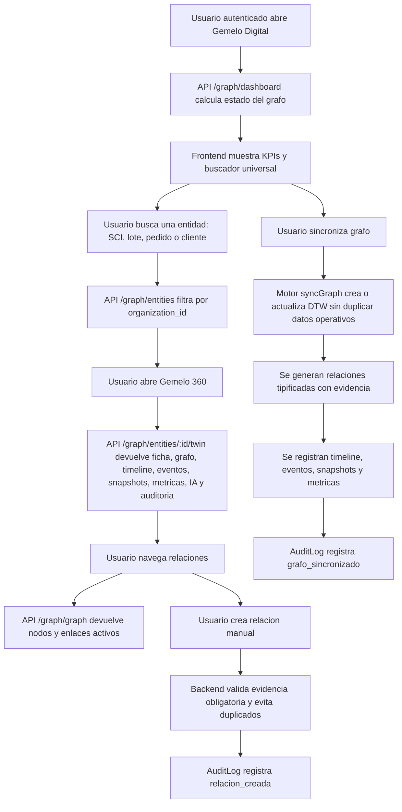

# Validacion Incremento 14 - Digital Twin + Knowledge Graph

Estado: IMPLEMENTADO, PENDIENTE DE APROBACION FORMAL.

## Alcance validado

- Gemelos digitales para entidades existentes del ERP.
- Grafo navegable transversal.
- Buscador universal.
- Vista 360 por entidad.
- Timeline universal.
- Relaciones tipificadas con evidencia obligatoria.
- Eventos, snapshots, metricas y vistas.
- Dashboard del grafo.
- UI responsive tipo sistema moderno de conocimiento.

## Diagrama de flujo del proceso



## Diagrama entidad-relacion

```mermaid
erDiagram
  ORGANIZATIONS ||--o{ ENTITY_TYPES : owns
  ORGANIZATIONS ||--o{ RELATION_TYPES : owns
  ORGANIZATIONS ||--o{ ENTITIES : owns
  ORGANIZATIONS ||--o{ ENTITY_RELATIONS : owns
  ORGANIZATIONS ||--o{ ENTITY_TIMELINE : owns
  ORGANIZATIONS ||--o{ ENTITY_EVENTS : owns
  ORGANIZATIONS ||--o{ ENTITY_SNAPSHOTS : owns
  ORGANIZATIONS ||--o{ ENTITY_METRICS : owns
  ORGANIZATIONS ||--o{ ENTITY_VIEWS : owns
  USERS ||--o{ ENTITY_RELATIONS : creates
  USERS ||--o{ ENTITY_TIMELINE : performs
  USERS ||--o{ ENTITY_EVENTS : triggers
  ENTITY_TYPES ||--o{ ENTITIES : classifies
  RELATION_TYPES ||--o{ ENTITY_RELATIONS : types
  ENTITIES ||--o{ ENTITY_RELATIONS : from
  ENTITIES ||--o{ ENTITY_RELATIONS : to
  ENTITIES ||--o{ ENTITY_TIMELINE : has
  ENTITIES ||--o{ ENTITY_EVENTS : has
  ENTITIES ||--o{ ENTITY_SNAPSHOTS : has
  ENTITIES ||--o{ ENTITY_METRICS : has
  ENTITIES ||--o{ ENTITY_VIEWS : has

  ENTITY_TYPES {
    string id PK
    string organization_id FK
    string code
    string name
    string module
    string status
  }
  RELATION_TYPES {
    string id PK
    string organization_id FK
    string code
    string name
    boolean bidirectional_default
  }
  ENTITIES {
    string id PK
    string organization_id FK
    string entity_type_id FK
    string permanent_code
    string source_entity_type
    string source_entity_id
    string title
    json kpis_json
  }
  ENTITY_RELATIONS {
    string id PK
    string organization_id FK
    string permanent_code
    string relation_type_id FK
    string from_entity_id FK
    string to_entity_id FK
    enum status
    text evidence
  }
  ENTITY_TIMELINE {
    string id PK
    string permanent_code
    string entity_id FK
    datetime event_at
    string module
    string action
    text evidence
  }
  ENTITY_EVENTS {
    string id PK
    string permanent_code
    string entity_id FK
    string event_type
    string source_module
    text evidence
  }
  ENTITY_SNAPSHOTS {
    string id PK
    string permanent_code
    string entity_id FK
    string snapshot_type
    json payload_json
    json source_json
  }
  ENTITY_METRICS {
    string id PK
    string entity_id FK
    string metric_key
    json value_json
    text source
  }
  ENTITY_VIEWS {
    string id PK
    string permanent_code
    string entity_id FK
    enum view_kind
    json config_json
  }
```

## Pruebas ejecutadas

- `npm.cmd run db:generate`: Prisma Client generado correctamente.
- `npm.cmd run build`: backend TypeScript y frontend Vite compilaron sin errores.
- `npm.cmd --workspace app/backend exec -- prisma migrate deploy`: migracion `20260803093000_incremento_14_digital_twin_graph` aplicada correctamente.
- `npm.cmd run db:seed`: seed ejecutado y grafo sincronizado.
- `npm.cmd run test`: 18 archivos de prueba, 40 pruebas aprobadas.
- API `POST /auth/login`: login demo correcto.
- API `GET /graph/dashboard`: retorna indicadores del grafo.
- API `GET /graph/entities?q=SCI`: retorna resultados de busqueda universal.
- API `GET /graph/graph`: retorna nodos y relaciones activas.
- API `GET /graph/entities/:id/twin`: retorna gemelo con timeline, eventos y snapshots.
- Navegador desktop: modulo renderizado con 36 nodos visibles, 5 KPIs y panel lateral.
- Navegador movil 390 x 844: modulo visible sin overflow horizontal.

## Resultados

- Gemelos digitales: 283.
- Relaciones activas: 157.
- Resultados de busqueda para `SCI`: 4.
- Grafo general: 156 nodos y 120 enlaces en consulta inicial.
- Gemelo validado: `DTW-000142`, con timeline, evento y snapshot.
- Vistas `GRF` creadas para grafo, arbol, timeline, tabla, tarjetas y vista 360.

## Correcciones realizadas durante validacion

- Se acortaron nombres de indices MySQL para cumplir limite de identificadores.
- Se limpio un intento parcial de migracion antes de aplicar la version corregida.
- Se amplio el seed para crear timeline, evento y snapshot por entidad sincronizada.

## Evidencias tecnicas

- Prisma schema: `app/backend/prisma/schema.prisma`.
- Migracion Prisma: `app/backend/prisma/migrations/20260803093000_incremento_14_digital_twin_graph/migration.sql`.
- SQL espejo: `database/migrations/017_incremento_14_digital_twin_graph.sql`.
- Servicio: `app/backend/src/services/graph.service.ts`.
- Rutas: `app/backend/src/routes/graph.routes.ts`.
- UI: `app/frontend/src/pages/DigitalTwinPage.tsx`.
- Prueba: `tests/backend/graph.test.ts`.

## Limitaciones pendientes

- La visualizacion usa un grafo SVG/HTML propio simple; no se integro motor externo tipo Neo4j.
- La IA queda preparada para consultar grafo, pero no se cambia todavia el razonamiento completo del asistente IA.
- Las relaciones demo se sincronizan desde entidades principales y no cubren aun todas las relaciones historicas posibles.
- No se implementa editor visual avanzado de layouts de grafo.

## Confirmacion final

Incremento 14 implementado y validado tecnicamente. Requiere aprobacion formal antes de iniciar Incremento 15.
