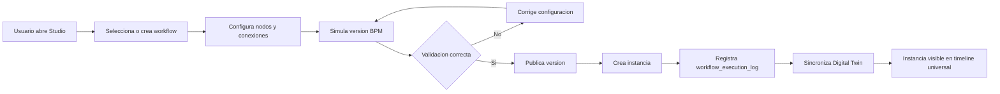
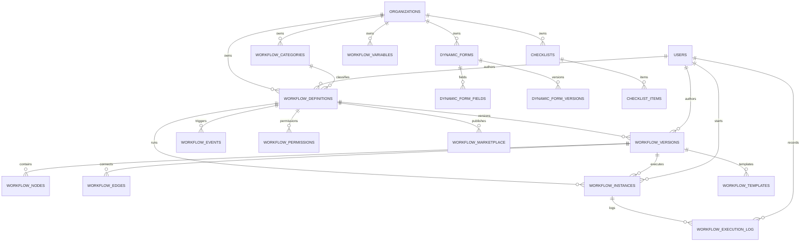
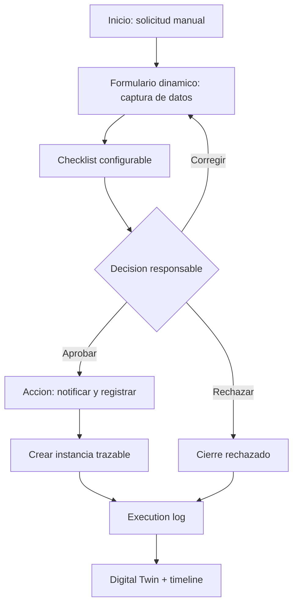

# Validacion Incremento 15 - Formula Lab Studio

Estado: IMPLEMENTADO / PENDIENTE DE APROBACION FORMAL.

## Alcance Validado

Se implemento Formula Lab Studio como motor transversal de workflows configurables. No se hardcodearon procesos especificos de produccion, laboratorio, compras, ventas o calidad; esos casos quedan representados como configuracion demo mediante nodos, formularios, checklists, eventos y variables.

## Diagrama BPM

## Diagrama ER

## Ejemplo Completo De Workflow

## Pruebas Ejecutadas

- `npm.cmd run db:generate`
- `npm.cmd run build`
- `npm.cmd --workspace app/backend exec -- prisma migrate deploy`
- `npm.cmd run db:seed`
- `npm.cmd test`
- Validacion HTTP autenticada contra:
  - `POST /auth/login`
  - `GET /studio/dashboard`
  - `GET /studio/workflows`
  - `POST /studio/workflows/:id/versions/:versionId/simulate`
  - `POST /studio/instances`
  - `POST /studio/sync-graph`

## Resultados

- Build backend/frontend: correcto.
- Migraciones Prisma: aplicadas correctamente.
- Seed demo: ejecutado correctamente.
- Pruebas automatizadas: 19 archivos, 43 pruebas aprobadas.
- API Studio autenticada: correcta.
- Demo cargada:
  - 12 workflows.
  - 8 formularios dinamicos.
  - 10 checklists.
  - 5 templates.
  - 20 instancias seed + instancias creadas durante validacion.
  - Workflows e instancias sincronizados al grafo.

## Errores Encontrados Y Correcciones

- La diff automatica de Prisma detecto ruido de indices/FKs historicos. Correccion: se genero una migracion manual acotada solo a tablas Studio.
- La primera aplicacion fallo por BOM UTF-8 en `migration.sql`. Correccion: archivo reescrito en UTF-8 sin BOM y migracion resuelta como rolled back antes de reaplicar.
- La sincronizacion Studio -> Graph generaba codigos `DTW-000000` que podian colisionar con entidades existentes. Correccion: se cambiaron a prefijos `DTW-STU-WKF` y `DTW-STU-INS`.

## Evidencias Tecnicas

- Migracion principal: `app/backend/prisma/migrations/20260803103000_incremento_15_formula_lab_studio/migration.sql`.
- SQL espejo: `database/migrations/018_incremento_15_formula_lab_studio.sql`.
- Servicio: `app/backend/src/services/studio.service.ts`.
- Rutas: `app/backend/src/routes/studio.routes.ts`.
- Validadores: `app/backend/src/validators/studio.schemas.ts`.
- UI: `app/frontend/src/pages/StudioPage.tsx`.
- Pruebas: `tests/backend/studio.test.ts`.

## Limitaciones Pendientes

- Drag & drop visual avanzado queda preparado por canvas y paleta; en este incremento se implementa interaccion funcional por seleccion y configuracion inicial.
- Automatizaciones externas, notificaciones reales, marketplace compartido entre empresas y reglas de ejecucion complejas quedan preparadas, no implementadas como integracion externa.
- La ejecucion BPM es MVP trazable; no incluye motor asincrono distribuido ni colas.

## Confirmacion Final

Incremento 15 implementado y validado tecnicamente. Requiere aprobacion formal del usuario antes de iniciar el Incremento 16.
