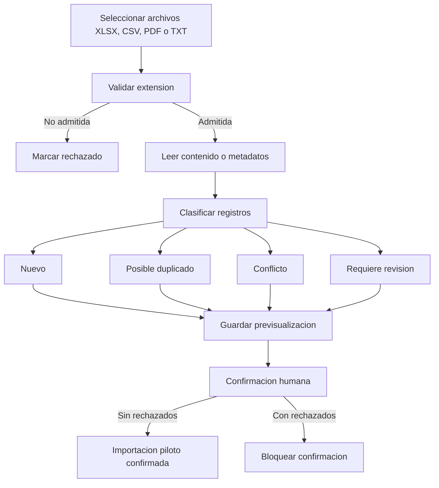
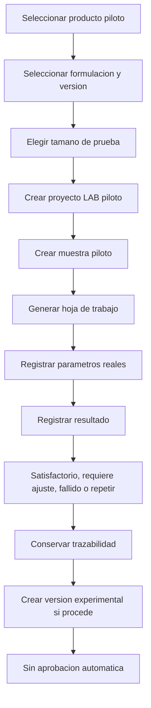
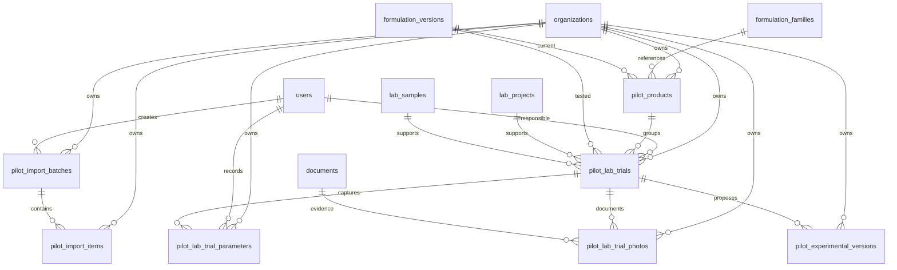

# Validacion Piloto - Datos Reales y Laboratorio de Pruebas

## Alcance Validado

- Modo visible `PILOTO / NO PRODUCTIVO`.
- Importacion preliminar de XLSX, CSV, PDF y TXT.
- Previsualizacion de registros nuevos, duplicados, conflictos, rechazados y en revision.
- Productos piloto.
- Pruebas de laboratorio desde formulaciones.
- Hoja de trabajo con gramos calculados.
- Registro de parametros.
- Resultado de prueba sin aprobacion automatica.
- Preparacion de version experimental trazable.

## Diagrama de Importacion

## Diagrama de Prueba de Laboratorio

## ER Piloto

## Pruebas Ejecutadas

- `npm.cmd run db:generate`: correcto antes de levantar servidores.
- `npm.cmd test`: 20 archivos de prueba, 46 pruebas aprobadas.
- `npm.cmd run build`: backend TypeScript y frontend Vite aprobados.
- `npm.cmd run db:migrate`: no aplico por fallo historico de shadow DB en `20260802234500_incremento_3_materias_primas_maestras`.
- `npx.cmd prisma db push` desde `app/backend`: base real sincronizada con el esquema Prisma sin destruir datos.
- `npm.cmd run db:seed`: seed aplicado correctamente con `upsert`.
- API autenticada:
  - `/auth/login`.
  - `/pilot/dashboard`.
  - `/pilot/products`.
  - `/pilot/trials`.
- Frontend:
  - `http://localhost:5173` responde `200 OK`.

## Resultados

- El modo piloto queda visible en el AppShell.
- Las rutas `/pilot/*` requieren autenticacion y filtran por `organization_id`.
- La previsualizacion no modifica entidades productivas.
- Las pruebas piloto generan trazabilidad LAB no productiva.
- Los resultados no aprueban formulaciones automaticamente.
- API validada con usuario `demo@formulalab.local`: 5 productos piloto y 5 pruebas piloto visibles.

## Limitaciones Pendientes

- Lectura profunda XLSX/PDF queda preparada como previsualizacion documental; el parseo semantico avanzado se delega a KDE e Inteligencia de Insumos.
- Adjuntar fotografias reales queda preparado mediante relacion con documentos; la captura binaria especifica puede ampliarse despues.
- La version experimental queda registrada como propuesta; la edicion detallada sigue usando el Gestor de Formulaciones aprobado.
- `prisma migrate dev` requiere corregir la migracion historica del Incremento 3 para que la shadow DB pueda reconstruirse desde cero; el esquema real fue sincronizado con `prisma db push`.

## Confirmacion

Incremento Piloto implementado y listo para aprobacion funcional.
